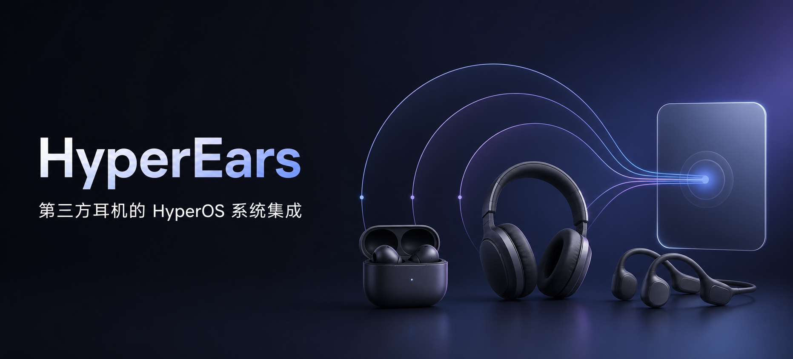

# HyperEars



[English](README_EN.md) · [安装指南](docs/installation.md) · [兼容性](docs/compatibility.md) · [控制 App 作用域](docs/control-apps.md) · [问题排查](docs/troubleshooting.md)

[](https://github.com/silverpoetry/HyperEars/actions/workflows/ci.yml)
[](https://github.com/silverpoetry/HyperEars/releases)
[](LICENSE)

HyperEars 是面向 Xiaomi HyperOS 的第三方蓝牙耳机系统集成模块。它让受支持的
vivo / iQOO、OPPO Enco、Technics、Bose、Edifier、StarRing、ROSESELSA、NiceHCK、水月雨、荣耀、华为、QCY 和 Sony 耳机
进入 MiLink 融合设备中心，并在不接管 Android 音频路由的前提下补充电量、降噪状态和
设备流转所需的兼容信息。

> [!WARNING]
> HyperEars 依赖 root、LSPosed 和 HyperOS 私有接口。安装前请确认能够恢复系统；ROM
> 更新可能暂时破坏兼容性。本项目与 Xiaomi、vivo、iQOO、OPPO、Bose、Edifier、
> Panasonic、Technics、ROSESELSA、NiceHCK、水月雨、荣耀、华为、QCY、Sony 及相关品牌无关。

## 能做什么

### 系统集成

- 将符合条件的第三方耳机接入 MiLink 融合设备中心，提供设备流转和系统音量。
- 对没有私有协议适配的标准 A2DP/HFP 耳机，提供同样的流转、音量和 Android 系统整机电量回退。

### 设备能力

- 按耳机形态和已确认的协议提供电量：左右耳与充电盒、头戴式整机，或 Android 系统整机。
- 仅在私有协议确认成功后发布降噪、关闭、通透和型号专属模式；未确认时不发布对应的私有控制。
- 支持旧版 HyperOS 与 HyperOS 4 的原生三态耳机卡片；已确认的抗风噪能力作为降噪分支开关
  呈现，不替换系统原生模式按钮。
- 已开放噪声控制的设备可点击 HyperEars 主页会话卡片中的“模式”指标，从下拉列表切换模式。
- MiLink 耳机卡片的“更多设置”可选择打开真实蓝牙设备详情、对应厂商控制 App 或 HyperEars；
  厂商 App 不可用时自动回退到系统设备详情。

### 会话与控制权

- 每台已连接耳机独立维护识别、连接通道、协议和 MiLink 发布状态，应用按设备分别展示这些状态。
- 开启“运行时退避”且对应厂商 App 已被 LSPosed Hook 时，App 运行期间让出私有协议控制权；MiLink
  流转、系统音量和 Android 音频路由继续由系统处理。
- 可暂停 HyperEars 集成；暂停不关闭 Android 蓝牙或音频路由，恢复后重新连接耳机建立新的模块会话。

### 设置与诊断

- 一级设置页可直接切换 Material 3/Miuix；“界面设置”提供明暗模式、界面缩放与当前风格
  支持的菜单栏选项。Material 3 始终使用系统动态配色与标准底栏；Miuix 可独立配置模糊
  和悬浮底栏，并提供效果预览。切换风格时保留当前页面、设置层级和耳机会话。
- 在设置页配置点击 MiLink 卡片“更多设置”时打开的目标，以及运行时退避、自动更新检查和
  模块暂停。
- 在“调试 > 适配器”中按品牌管理每个具体型号、家族回退和标准回退 Adapter；品牌总开关可一次停用或恢复该组全部 Adapter。
- 在“调试”页面开启详细日志并导出诊断报告。
- 提供需要 Root 的重启 MiLink、重启蓝牙和停止厂商 App 操作。
- 详细日志关闭时不产生模块诊断记录；开启后，注入进程日志写入 LSPosed 守护进程，设置变更和快捷操作
  结果写入应用本地滚动日志，导出时合并为一个文本文件。

## 运行边界

HyperEars **不会**替换 Android 的 A2DP/HFP 音频链路，不会转发音频流，也不会持续扫描蓝牙。私有
GATT、RFCOMM 或 BR/EDR L2CAP 控制通道只为需要协议遥测的适配器建立，并绑定到对应的设备会话。

## 兼容性概览

| 适配范围 | 证据等级 | 电量能力 | 噪声控制 |
|---|---|---|---|
| vivo / iQOO TWS | 实机验证、公开实现、家族外推 | 私有组件电量 | 降噪、关闭、通透 |
| OPPO Enco | 参考协议 | 私有组件电量 | 降噪、关闭、通透 |
| StarRing / 籁特易耳 | Ultra 实机验证；其他标准回退 | Ultra 私有组件电量；其他系统整机电量 | Ultra 支持降噪、关闭、通透、抗风噪 |
| Bose | 一个型号实机验证；其余公开实现、参考协议或家族外推 | 私有整机或组件电量 | 按 BMAP 产品和控制方言开放明确的模式子集 |
| Edifier / 漫步者 | W860NB PRO、花再 Evo Pro 实机验证；其余家族外推 | 头戴整机、TWS 左右耳或聚合电量 | 降噪、关闭、通透、抗风噪 |
| ROSESELSA / 弱水时砂 | Furina Endless Solo of Solitude、ROSE Ceramics Ultra 实机验证；两个型号公开实现；产品线家族外推；其余标准回退 | 协议确认后私有组件电量；回退设备使用系统整机电量 | 协议确认后支持降噪、关闭、通透、抗风噪 |
| NiceHCK / YuanDao | OriG in 公开实现；其他标准回退 | 协议确认后私有组件电量；回退设备使用系统整机电量 | OriG in 支持降噪、关闭、通透、抗风噪 |
| MOONDROP / 水月雨 | Robin 公开协议；Pudding 实机验证；其他标准回退 | Robin 协议确认后提供左右耳电量；Pudding 协议确认后提供左右耳与充电盒电量，回退设备使用系统整机电量 | Robin 协议确认后支持降噪、关闭、通透；Pudding 实机验证后支持降噪、关闭、通透 |
| 荣耀 | X5s Pro 实机验证；其他标准回退 | X5s Pro 协议确认后提供私有组件电量；回退设备使用系统整机电量 | X5s Pro 协议确认后支持降噪、关闭、通透 |
| 华为 | FreeBuds 5i、FreeBuds Pro 3 实机验证；FreeBuds 4 公开实现；FreeBuds / FreeClip / FreeLace 家族探测；其余标准回退 | 合法协议响应后提供私有组件或整机电量；回退设备使用系统整机电量 | 5i、Pro 3 支持三态；Pro 3 另有型号专属档位；FreeBuds 4 支持降噪、关闭；家族候选在协议确认后支持三态，不开放档位 |
| QCY | Crossky C50S 公开协议；同协议家族探测；其余标准回退 | 协议确认后提供私有组件电量；回退设备使用系统整机电量 | 协议确认后支持降噪、关闭、通透 |
| Technics EAH-AZ TWS | AZ80 实机验证；其他型号采用公开实现，参考实现由贡献者在 AZ60、AZ80、AZ100 等型号验证 | 协议确认后提供私有组件电量 | 合法模式状态响应后支持降噪、关闭、通透；AZ80 已完成三态写入和设备回读实测 |
| Sony | 公开实现、家族外推、标准回退 | 按设备形态提供私有整机、私有组件或系统整机电量 | 按具体型号开放表中明确列出的模式 |
| 其他标准 A2DP/HFP 耳机 | 标准回退 | 系统整机电量 | 无 |

所有条目均提供设备流转和系统音量。“公开实现”“参考协议”和“家族外推”均不等于
实机验证。家族名称只用于选择候选协议；需要确认的适配器还会校验服务、线端身份或
合法状态帧。完整型号、证据等级、判型条件、私有传输和开放能力见
[兼容性文档](docs/compatibility.md)。

## 系统要求

- Xiaomi HyperOS，Android 15 或更高版本；
- 已安装并正常工作的 LSPosed，API 版本不低于 101；
- LSPosed 必选作用域：`com.android.bluetooth`、`com.milink.service`；
- 如果要启用“运行时退避”，还需按
  [控制 App 目录](docs/control-apps.md#2-当前目录)勾选实际安装并使用的控制 App；仅执行
  “更多设置”厂商 App 跳转时，安装且可启动即可；
- 耳机已通过系统蓝牙完成配对。

目前公开测试基线来自 HyperOS 设备，包含 HyperOS 4 的 MiLink 原生三态卡片。AOSP、MIUI、
非小米 ROM 和低于 Android 15 的系统不在支持范围内。

## 安装

1. 从 [Releases](https://github.com/silverpoetry/HyperEars/releases) 下载 APK 和同名
   `.sha256` 文件，不要安装来源不明的重打包版本。
2. 校验 SHA-256：

   ```powershell
   Get-FileHash .\HyperEars-vX.Y.Z.apk -Algorithm SHA256
   ```

3. 安装 APK，在 LSPosed 中启用 HyperEars，并至少确认 `com.android.bluetooth` 和
   `com.milink.service` 已选中。若使用厂商控制 App 退避，再按
   [控制 App 目录](docs/control-apps.md#2-当前目录)选择对应且已安装的包名；不要选择
   Settings、System UI 或所有应用。
4. 重启设备。仅强停 MiLink 不一定会让两个目标进程同时重新加载模块。
5. 连接耳机后打开 HyperEars，确认对应会话显示正确的 Adapter、形态、传输和能力，
   并观察 MiLink 的状态接收、身份查询、能力查询与通知阶段。

从早期开发测试包迁移到首个公开 Release 时，若 Android 提示签名不一致，需要先在
LSPosed 禁用旧模块、卸载旧 APK，再安装公开版并重新启用。详细升级和卸载步骤见
[安装指南](docs/installation.md)。

## 设计边界

```text
Android 蓝牙事件
        │
        ▼
EarbudConnectionManager ── 每个蓝牙地址一个逻辑会话
        │
        ▼
EarbudAdapter             ── 当前设备身份、能力、配置与运行状态
        │ owns
        ▼
ProtocolSession           ── 每会话独立、可随 Adapter 替换转移的协议状态
        │ uses
        ▼
WireCodec                 ── 纯字节编解码
        │
        ▼
DeviceStateRegistry       ── 带 token/revision 的进程内状态
        │
        ▼
MiLinkServiceHook         ── 最小身份、状态与控制映射
```

- `protocol`：纯帧编解码，不创建连接、不依赖界面。
- `integration`：设备识别、状态化 Adapter、能力模型和每会话 `ProtocolSession`。
- `system-module`：LSPosed 入口、蓝牙生命周期、MiLink 桥和运行看板。
- `protocol-test`：开发者使用的只读/显式控制协议实验工具，不随正式 Release 发布。

控制操作统一以强类型请求表示：卡片提交标准或型号专属请求，Adapter 按当前已确认能力
校验，框架自动完成 MiLink 与 Bluetooth 进程之间的版本化传输，ProtocolSession 只把通过
校验的请求转换为厂商字节帧。新增型号不需要手写 IPC 或 JSON。

电量、噪声模式和后续型号专属状态统一使用带类型的特性快照传递。协议握手、能力确认和
连接生命周期保持独立；MiLink 的原生电量与 ANC 回调只在桥接边界读取标准特性投影，不会
限制新型号的状态模型。

名称、服务 UUID、设备形态和具体型号配置只选择候选协议。所有初始私有 Adapter 都从
系统整机电量与流转能力起步，合法电量和模式响应分别开放对应私有能力；Registry 在加载时
验证这一门禁，防止新增适配再次把身份匹配当成能力证明。

系统模块不注入 HyperOS 设置页，不轮询 UI，也不替换系统蓝牙音频服务。型号专属卡片
扩展只在 MiLink 卡片绑定时执行，并由具体 Adapter 声明。完整架构见
[系统模块架构](docs/system-module-architecture.md)。

### 控制权退避

HyperEars 只负责 MiLink 的标准集成、设备流转、系统音量和标准系统电量。开启“运行时退避”
后，适配器声明且已被 LSPosed Hook 的厂商控制 App 运行时，模块通过该 App 进程的 Binder
存活状态让出私有协议控制权，关闭自己建立的 GATT、RFCOMM 或 L2CAP 通道，卡片退化为
标准耳机能力。这个判据不依赖厂商 App 是否创建了蓝牙连接；App 崩溃、被强停或进程退出
都会通过 Binder death 自动恢复。App 运行期间仍由蓝牙进程维护耳机会话和标准蓝牙状态。
支持的应用名称、包名、声明顺序及作用域条件见[控制 App 目录](docs/control-apps.md)。

## 隐私与安全

- 正式应用仅使用 `INTERNET` 权限访问 GitHub Releases：自动检查默认开启，只在打开
  HyperEars 时运行且每天最多一次，也可在“关于”页手动检查；不包含分析、遥测、广告或
  崩溃上报 SDK。
- 蓝牙地址只用于本机会话关联；正式日志默认对地址脱敏。
- 协议测试工具会显示目标地址和原始帧，分享日志前必须手动脱敏。
- 应用数据禁止系统备份；禁用并卸载模块即可移除其应用侧数据。

详见 [隐私说明](PRIVACY.md) 和 [安全策略](SECURITY.md)。

## 构建与验证

需要 JDK 17 和 Android SDK 36：

```powershell
.\gradlew.bat --no-daemon clean testDebugUnitTest `
  :protocol-test:assembleDebug `
  :system-module:lintRelease `
  :system-module:assembleRelease
```

没有提供 Release 签名环境变量时，Gradle 只生成未签名 Release APK。正式发布使用：

- `HYPEREARS_KEYSTORE_PATH`
- `HYPEREARS_KEYSTORE_PASSWORD`
- `HYPEREARS_KEY_ALIAS`
- `HYPEREARS_KEY_PASSWORD`

CI 会验证 Markdown 结构、站内链接、控制 App 目录一致性、单元测试、Android Lint 和
Release 编译；带 `v*` 标签的发布工作流使用仓库 Secrets 签名、验证 APK，并同时生成
SHA-256 文件。

## 文档

- [安装、升级与卸载](docs/installation.md)
- [设备兼容性与证据等级](docs/compatibility.md)
- [厂商控制 App 与 LSPosed 作用域](docs/control-apps.md)
- [常见问题与日志采集](docs/troubleshooting.md)
- [发布签名与产物验证](docs/release-signing.md)
- [系统模块架构](docs/system-module-architecture.md)
- [运行看板语义](docs/dashboard-ui-architecture.md)
- [vivo TWS Air3 Pro 协议](docs/vivo-tws-air3-pro-protocol.md)
- [vivo/iQOO 家族画像](docs/vivo-family-support.md)
- [OPPO Enco 协议](docs/oppo-enco-protocol.md)
- [Bose BMAP 协议](docs/bose-bmap-protocol.md)
- [Sony Headphones 协议](docs/sony-headphones-protocol.md)
- [MOONDROP Robin 协议](docs/moondrop-robin-protocol.md)
- [MOONDROP Pudding 协议](docs/moondrop-pudding-protocol.md)
- [QCY 标准 GATT 协议](docs/qcy-standard-gatt-protocol.md)
- [StarRing Ultra 协议](docs/starring-ultra-protocol.md)
- [Edifier (BES) 协议](docs/edifier-bes-protocol.md)
- [荣耀 X5s Pro 协议](docs/honor-x5s-protocol.md)
- [华为 FreeBuds 协议](docs/huawei-freebuds-protocol.md)
- [Technics EAH-AZ / Airoha RACE 协议](docs/technics-race-protocol.md)

## 贡献

新增型号应提供可复现证据，并遵循“具体型号 → 厂商家族 → 标准耳机”的回退顺序。
请不要在 Issue、提交或日志中公开完整个人设备 MAC、账号信息、密钥或厂商专有资源。
开发流程和证据要求见 [CONTRIBUTING.md](CONTRIBUTING.md)。

## 许可与致谢

HyperEars 以 [GNU GPL-3.0-only](LICENSE) 发布。协议研究参考了
[1812z/OppoPods](https://github.com/1812z/OppoPods)、
[DOHEX/HyperRose](https://github.com/DOHEX/HyperRose)、
[Art-Chen/HyperPods](https://github.com/Art-Chen/HyperPods)、
[ZaeXT/NiceHCK_Controller](https://github.com/ZaeXT/NiceHCK_Controller)、
[Plutoberth/SonyHeadphonesClient](https://github.com/Plutoberth/SonyHeadphonesClient)、
[SouthautumnYa/QCYpods](https://github.com/SouthautumnYa/QCYpods)、
[Star-ZER0/Pods-Protocol-Reverse-Engineering](https://github.com/Star-ZER0/Pods-Protocol-Reverse-Engineering)
、[MelianMiko/OpenFreebuds](https://github.com/MelianMiko/OpenFreebuds)
 和 [moculll/ScrewVivoTWS](https://github.com/moculll/ScrewVivoTWS)，并包含本项目的实机
抓包与验证结果。具体来源及许可说明见 [THIRD_PARTY_NOTICES.md](THIRD_PARTY_NOTICES.md)。

商标和产品名称仅用于兼容性描述，归各自权利人所有。

QCY 协议资料入口与 `QYCC50S` 设备标识由
[@998-998](https://github.com/998-998) 在
[PR #21](https://github.com/silverpoetry/HyperEars/pull/21) 中提供。
